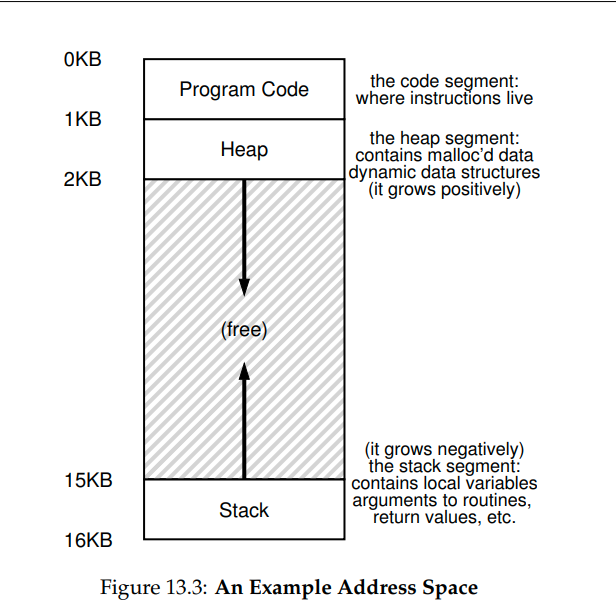

# note of chapter 13(vm-intro)
## 13.3 The Address Space
1. the address space of a process contains all of the memory state of the running program(like code, stack, heap, etc)
   * notice that address space is an **abstraction** (the program is not in memory at physical address 0 through 16KB)
   * **virtualize memory**: the running program thinks it is loaded into memory at a particular address(in this example, 0) and has a potentially very large address space

## 13.4 Goals
1. **transparency**: OS should implement virtual memory in a way that is **invisible** to the running program
2. **efficiency**: time and space
3. **protection**