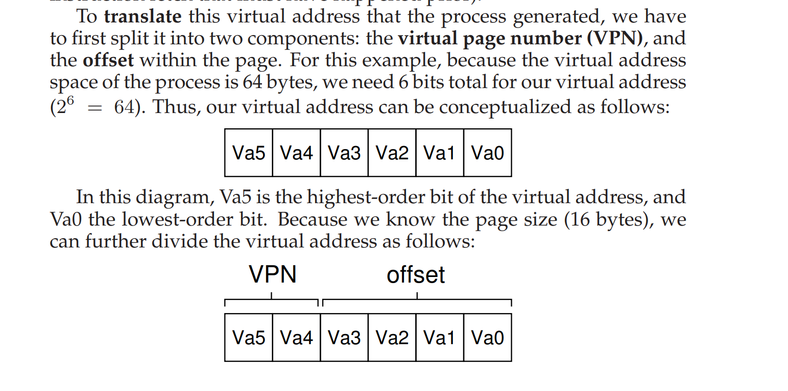
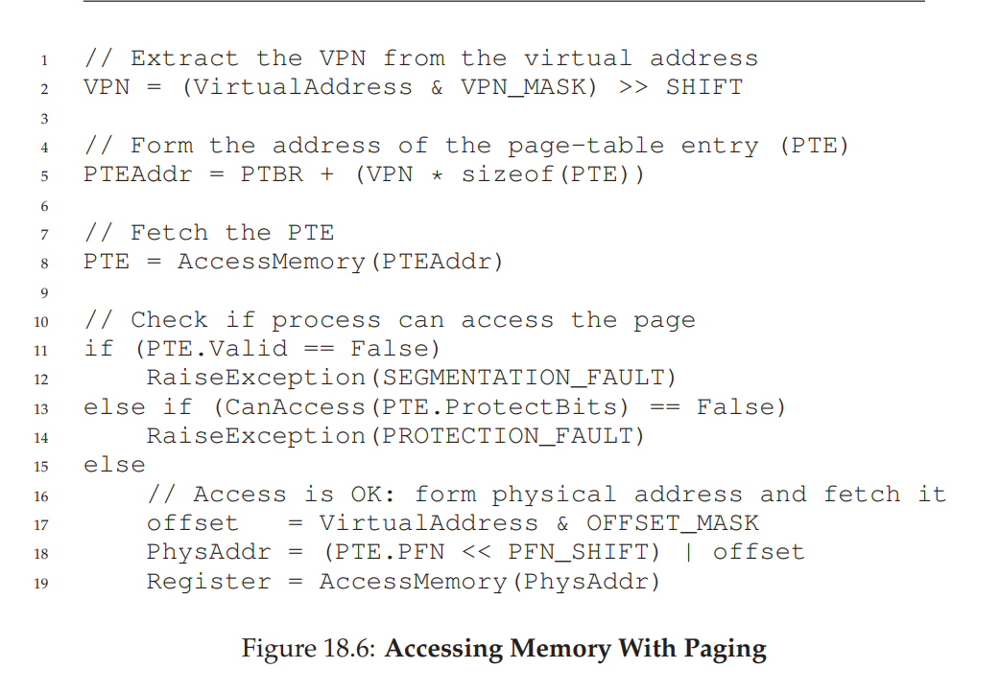

# note of chapter 18

#### space-management problem

as talked in chapter 17, **the first approach** is to chop things up into *variable-sized* pieces, but this approach inherent some difficulties(in particular, the space can be **fragmented**, and thus allocation becomes more challenging over time)

**the second approach** is to chop things up into fixed-sized pieces(**paging**)

## 18.1 A Simple Example And Overview

1. improvements:
   1. **flexibility**: with a fully-developed paging approach, the system will be able to support the abstraction of an address space effectively
   2. **simplicity**: the simplicity of free-space management that paging affords
2. **page table(pre-process data structure)**: store address translations for each of the virtual pages of the address space, thus letting us know where in physical memory each page resides.
3. address translation:

## 18.2 Where Are Page Tables Stored

page tables are so big, we store the page table for each process in memory **somewhere**

## 18.3 What's Actually In The Page Table

1. linear page table: The OS indexes the array by the virtual page number (VPN), and looks up the page-table entry (PTE) at that index in order to find the desired physical frame number (PFN)
2. the content of PTE: 
   1.  valid bit: indicate whether the particular translation is valid 
   2. protection bits: indicate whether the page could be read from, written to, or executed from.
   3. present bit: indicate whether this page is in physical memory or on disk(i.e., it has been **swapped out**)
   4. dirty bit: indicate whether the page has been modified since it was brought into memory
   5. reference bit(access bit): track whether a page has been accessed and is useful in determining which pages are popular and thus should be kept in memory

## 18.4 Paging: Also Too Slow

1. 

now **two** real problems to solve: page tables will cause the system to **run too slowly**, as well as **take up too much memory**

## 18.5 A Memory Trace

