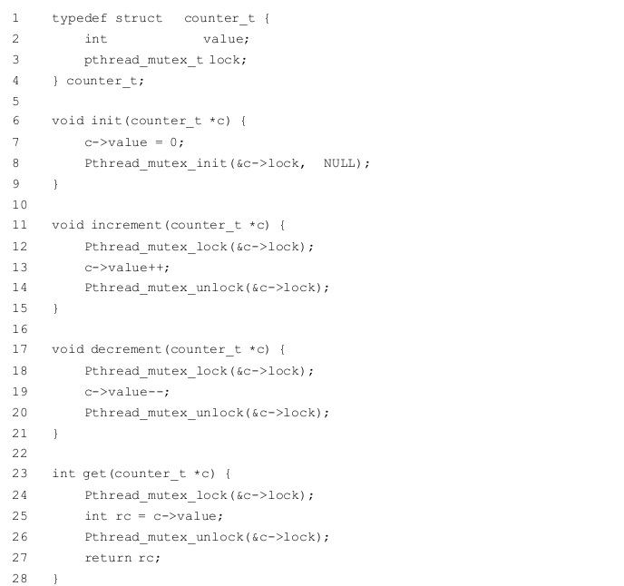
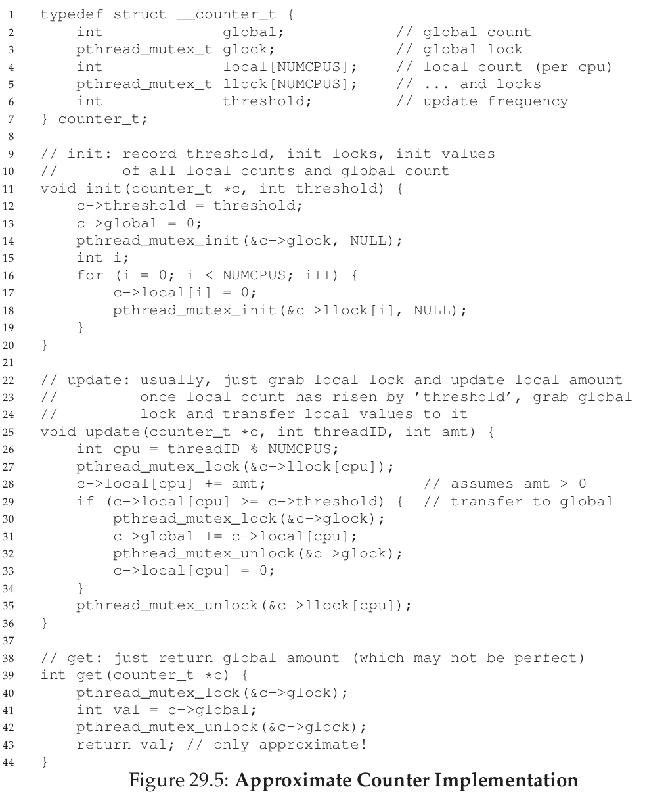
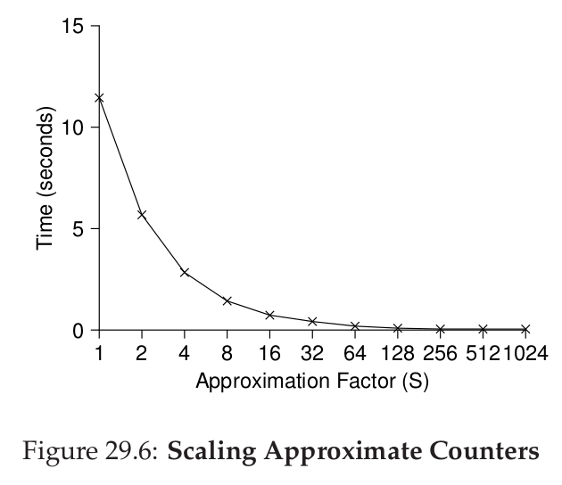
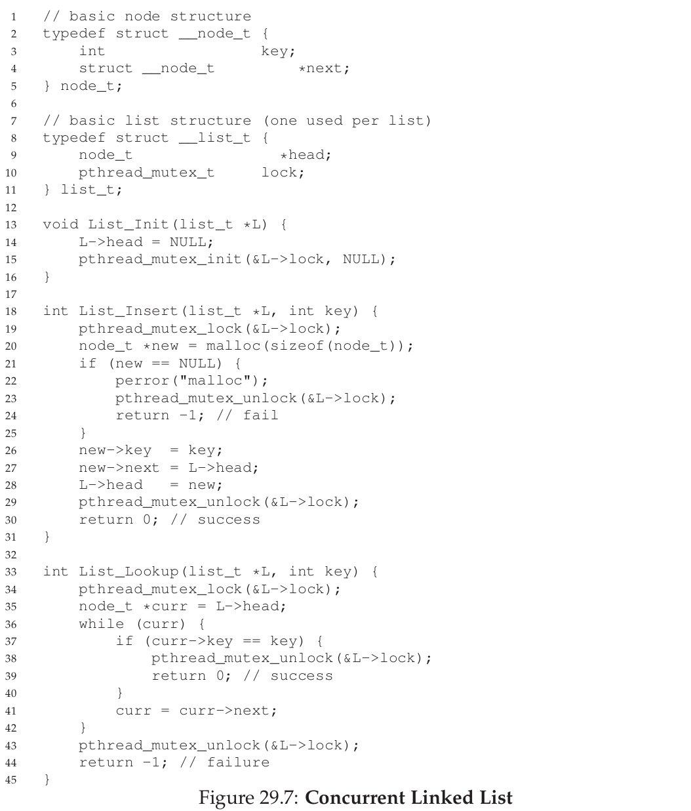
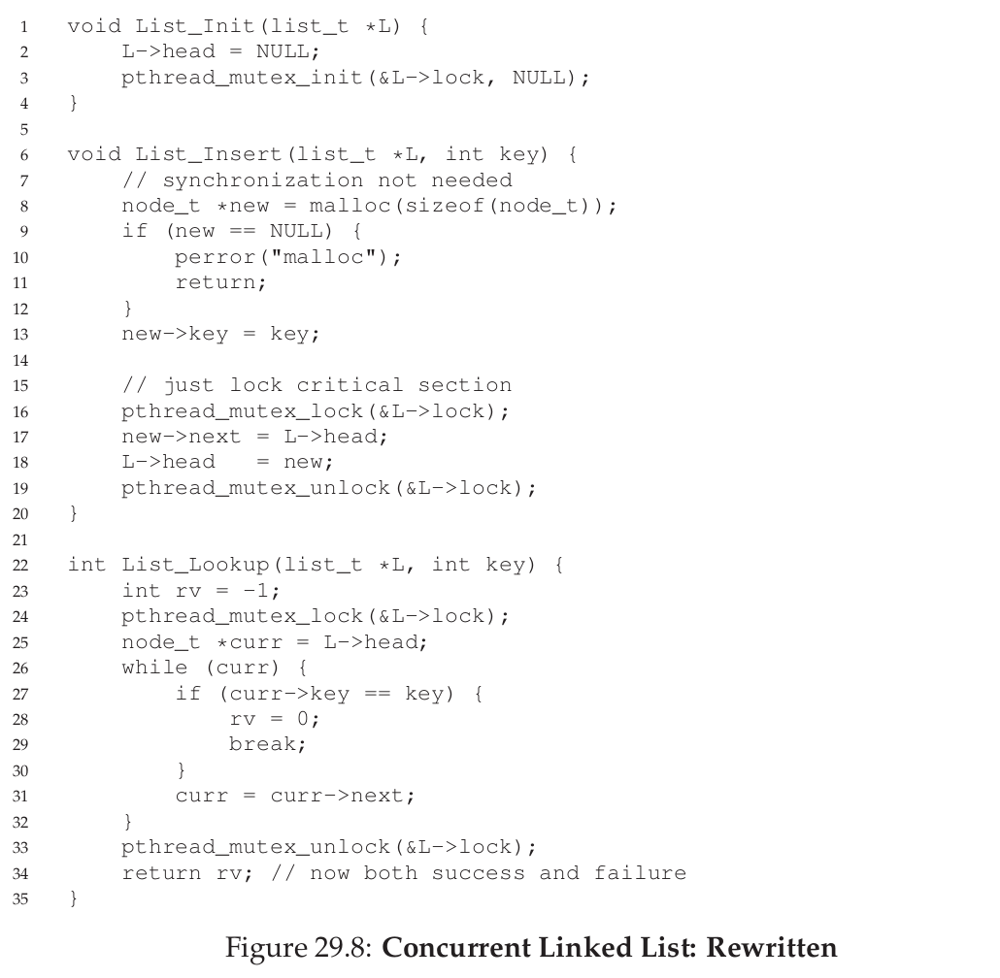
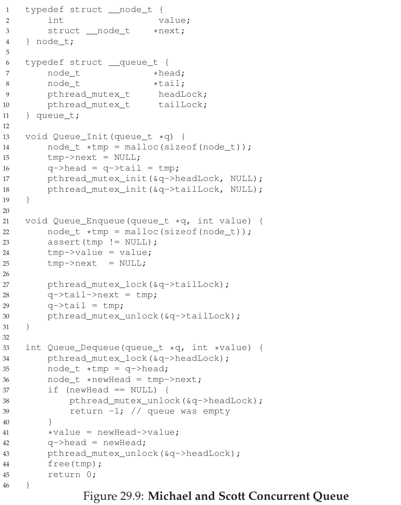
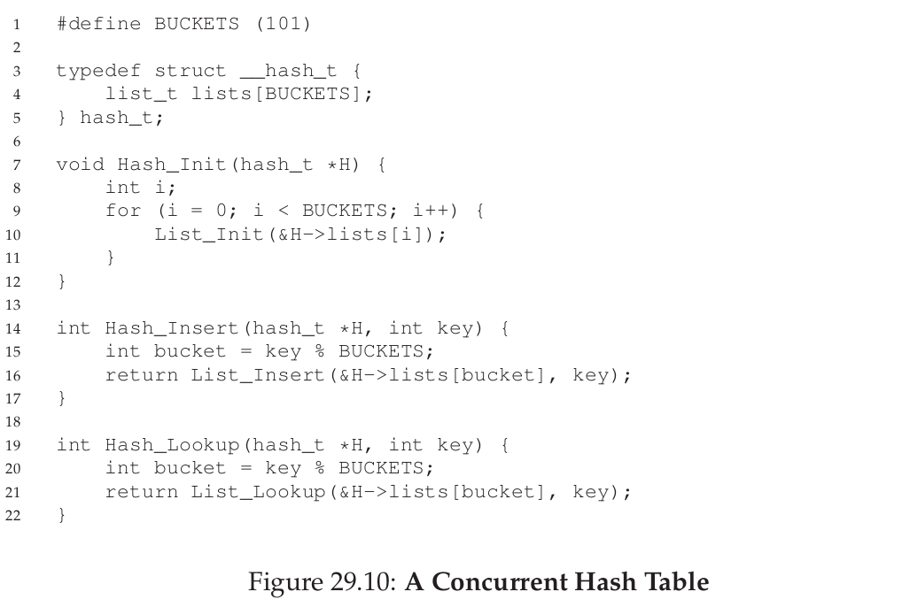

# note of chap 29 (并发数据结构)
通过锁可以让数据结构线程安全 (thread-safe)

## 并发计数器

每次操作上一把锁，简单，但规模小，不易于扩展(scalable)。

## 可拓展的并发计数器
当一个核心中的线程想要增加计数器时，首先增加他自己的本地(local)计数器，这个过程通过一把本地锁(local lock)进行同步。因为每个CPU核心都有自己的计数器，不同的线程可以无竞争地更新自己的计数器，因此更新计数器是可扩展的。

要使全局计数器保持更新，本地值必须每隔一段周期转移到全局计数器上。通过获得全局锁并将本地值加到全局值上，然后将本地值设为0即可完成。

这个更新过程通过阈值SS来控制。SS越小，计数器的行为越像上面那个无法拓展的计数器；SS越大，计数器越可扩展，但全局计数器的值与真实值之间的差异越大。程序可以通过获得所有本地锁和全局锁来获得真实的计数值，但这样的操作不可扩展。

## 并发链表

给每次List操作上一把锁，可扩展性较低。

给链表中的每个节点上一把锁，可扩展性高，可以多线程进行同时遍历。但这种实现方式在应用中未必比一把大锁效率高。

## 并发队列

队列的头、尾各有一把锁，可以同时进行入队、出队操作。

## 并发hash表

每一个hashing空位都是一个链表，各自有一把锁，允许同时进行插入和查找。

## 结语
更大的同步性并不代表更好的性能；

抛开负载谈优化都是耍流氓。

This last point, of avoiding premature optimization, is central to any performance-minded developer; there is no value in making something fadter if doing so will not improve the overall performance of the application.