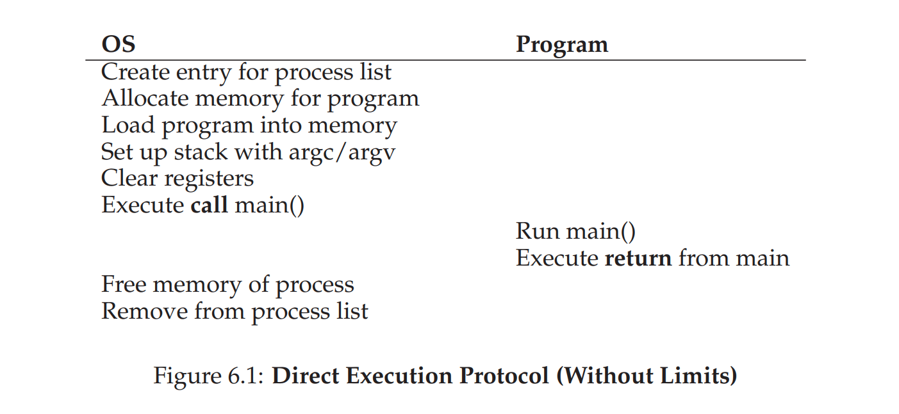
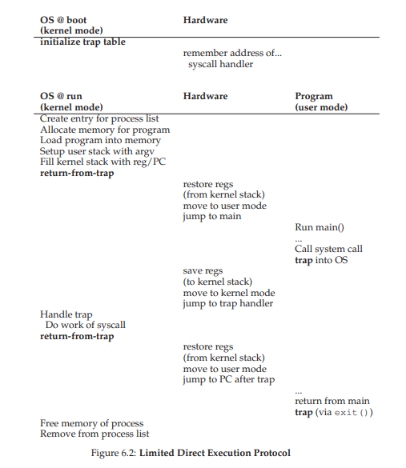
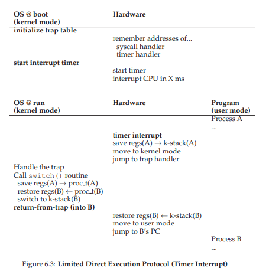

# note of chapter 6 (cpu-mechanism)

## 6.1 limited direct execution
1. **direct execution**: just run the program directly on the CPUs.the figure shows this basic direct execution protocol (notice this is no limit situation)

####  direct execution causes two problems
## 6.2 restricted operations
#### the first one: restricted operations
1. to solve **restricted operations** problem[it's obvious that we can't easily let the process do whatever it want(for example, io request) since this will cause all protections fail], **user mode** and **kernel mode**  
   1. user mode: code runs in this mode is restricted in what it can do
   2. kernel mode: os runs in so code runs in this mode can do what it likes

2. **system call**:if code in user mode wishes to perform privileged operation, use system call  
    1. **trap** instruction: jump into the kernel and raise the privilege level to kernel mode
       * a detail about how does the trap know which code to run inside the os: **trap table** and **system-call number** which makes user code cannot specify an exact address to jump to but can request a particular service via number
    2. do what it wishes to do in kernel mode
    3. **return-from-trap** instruction: return into the calling user program and reduce the privileged level back to user mode
       *  **notice**: to make sure to be able to return correctly when **return-from-trap**, os needs to save enough informations (on x86,what will it save? including registers, flags, program counter and so on)
3. **limited direct execution**, also called **LDE**

## 6.3 switching between processes
#### The second one: switching between processes
briefly describe: **if a process is running on the CPU, it means that the os is not running. how can the os regain control of the CPU so that it can switch between processes?**

1. cooperative schedule: os regains control of the CPU by **waiting for a system call** or **an illegal operation**(like dividing by zero, tring to access memory that it shouldn't be able to access)  
   * not good enough: **passive**(if infinite loop, os can't help)

2. **non-cooperative schedule**: os takes control
   * **timer interupt**: timer device cand raise an interupt every so many milliseconds; when an interupt is raised, the current process is halted and a pre-configured **interupt handler** in the os runs(of course os must inform the hardware of which code to run when the timer interupt occurs and start timer during the boot sequence)

3. **scheduler**: a part of the operating system, which makes decision on whether to continue running the current-running process ,or switch to a different one

4. **context switch**: save a few register values for the current-executing process and restore a few for the soon-be-executing process, here is an example of context switch from Process A to Process B  

## summary and a vital problem
* summary:
  * we have described some key low-level mechanisms to implement CPU virtualization
  * a set of techniques which we refer to as **LDE**
* problem: which process should we run at a given time? **scheduler** answer the question

