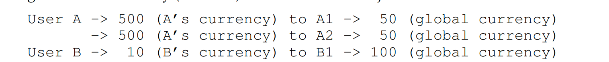
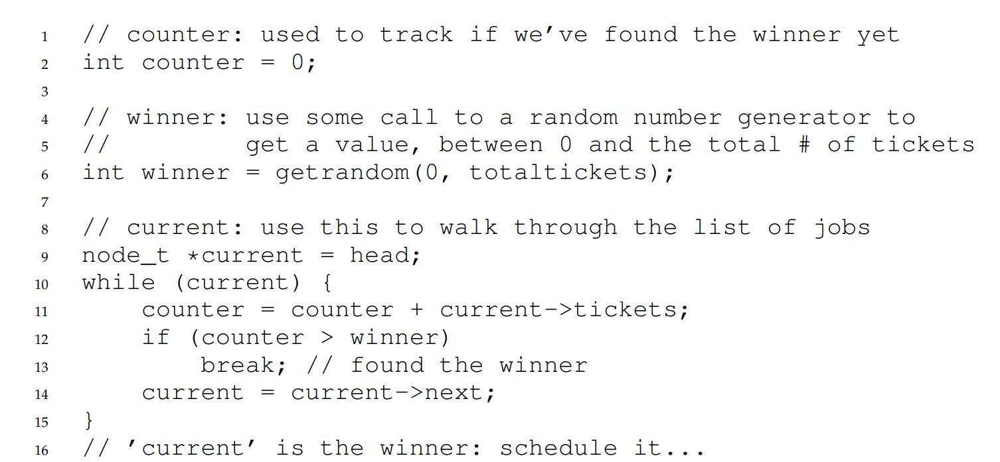

# note of chapter 9 (cpu-sched-lottery)

1. A different type of scheduler: **proportional-share** scheduler,also called **fair-share** schduler  
   * basic concept: instead of optimizing for turnaround or response time, a scheduler might try to guanrantee that **each job obtain a certain percentage of CPU time**
   * example: **lottery scheduling** (hold a lottery to determine which process should get to run next; processes that should run more often should be given more chances to win the lottery.)

## 9.1 Basic concept: Tickets Represent Your Share
1. basic basic concept: **ticket**(represent the share of a resource that a process should receive)
2. use **random** to decide which process should run  
   *  for example, process A has 75 tickets 0 through 74 and B has 25 tickets 75 through 99. By using random to generate a number in [0,99] can we decide to run process A/B.

## 9.2 Ticket mechanisms
1. **ticket currency**: a user with a set of tickets to allocate tickets among their own jobs in whatever currency they would like; the system then automatically converts said currency into the correct global value.

2. **ticket transfer**: a process can temporarily hand off its tickets to another process
3. **ticket inflation**: a process can temporarily raise or lower the number of tickets it owns.

## 9.3 Implementation
1. three things we need: a good random number generator to pick the winning ticket, a data structure to track the processes of the system, and the total number of tickets
2. codes to find the winner process: 

## 9.5 how to assign tickets
remains open~~~~

## 9.6 Stride Scheduling
1. stride: inverse in proportion to the number of tickets it has
2. basic idea:  at any given time, pick the process to run that has the lowest pass value so far; when you run a process, increment its pass counter by its stride
3. compared to lottery schduling:, lottery scheduling has one nice
property that stride scheduling does not: no global state.
    * Imagine a new job enters in the middle of our stride scheduling example above; what should its pass value be? Should it be set to 0? If so, it will monopolize the CPU

## 9.7 The Linux Completely Fair Scheduler(CFS)
#### Basic Operation
1. goal: fairly divide a CPU evenly among all competing processes
2. **virtual runtime(vruntime)**: CFS will pick the process with the lowest vruntime to run next
   * In the most basic case, each process’s vruntime increases at the same rate, in proportion with physical (real) time. 
3. how does the scheduler know when to to stop the currently running process, and run the other one? **by various control parameters** 
   1. **sched_latency**: determine how long one process should run before considering a switch (effectively determining its time slice but in a dynamic fashion).
   2. **min_granularity**: CFS will never set the time slice of a process to less than this value, ensuring that not too much time is spent in scheduling

#### weighting (niceness)
1. nice level of process

#### using red-black trees
when the scheduler has to find the next job to run

#### dealing with I/O and sleeping processes
1. altering the vruntime of a job when it wakes up(CFS sets the vruntime of that job to the minimum value found in the tree which contains running jobs only)